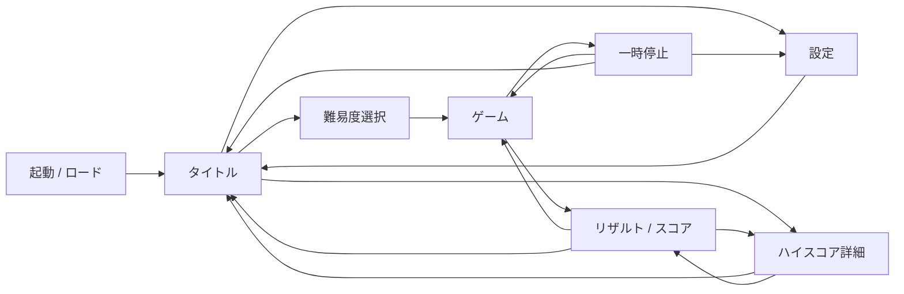

# ブロック崩しローグライク 基本設計書

## エグゼクティブサマリ

本案件は、実際には提供済みの2本のMarkdown資料を一次要件として採用できるため、会話文の「要件mdは未提示」という前提はこの回答時点では更新されます。ゲームの中核は、Windows向けデスクトップ配布を前提にした、透過PNG由来のシルエットをセル化して崩す無限モードのローグライク型ブロック崩しであり、技術構成は TypeScript / Phaser / Vite / pnpm / Tauri が最も整合しています。fileciteturn0file1 fileciteturn0file0

本設計では、ダークテーマのタイトル画面サンプルが持っているであろう「強い視線誘導」「難易度選択」「ハイスコア表示」という構造は保持しつつ、見た目の重心を明るいニュートラル背景へ置き換え、主要操作はブルー、補助要素はティール、難度や警告はアンバー系で整理します。さらに、キーボード主体で迷わない導線、見失わないフォーカス、色だけに依存しない表示、短く制御可能なモーションを必須要件として組み込みます。citeturn2search8turn4search2turn1search2turn3search0turn9search0turn5search1turn5search7turn13search3turn13search0turn5search5

現時点でUI仕様を詰めるうえで最大の未確定事項は、ゲームプレイ外入力の割当、スキル発動入力、ビルド・強化選択の出し方、設定画面の範囲、ローカルハイスコアの保存件数と表示粒度、対応言語、マウス/コントローラ対応の有無です。これらは設計書上は「未指定」と明記し、実装前に優先度順で凍結する前提にします。fileciteturn0file1

## 前提と要件整理

以下の整理は、提供された要件定義と技術スタック定義を統合し、さらに「ダークテーマのサンプル画像を明るいテーマへ再設計する」という追加条件を反映したものです。fileciteturn0file1 fileciteturn0file0

| 項目 | 現時点の整理 | 扱い |
|---|---|---|
| 要件元資料 | 「ブロック崩し_要件定義.md」「ブロック崩し_技術スタック定義.md」の2本を一次要件として採用 | 確定 |
| 画像サンプル | ダークテーマのタイトル画面サンプルとして扱う。ただし、厳密な色コード、文字文言、余白寸法、装飾密度は未指定 | 一部未指定 |
| 対象プラットフォーム | Windows デスクトップ、配布形式は setup.exe / .msi | 確定 |
| ゲームモード | 無限モードのみ。終了条件は残機0 | 確定 |
| ゲームプレイ入力 | 左右移動（キーボード、リバインド可）。サーブ（クリック/↑/スキルキー）、ポーズ（Esc既定）、スキル（Space既定/右クリック）。マウスX追従にも対応 | 確定 |
| データ保存 | localStorage で設定（`breaking-blocks-settings-v1`）とハイスコア（`breaking-blocks-highscores-v1`、Top 20、全難易度一括）を保存 | 確定 |
| テーマ方針 | 明るいテーマを既定値とする。将来的にダークテーマへ拡張できる設計にすることを推奨 | 提案 |
| 周辺機能 | キーコンフィグ実装済み。マウスはパドル追従＋メニュー操作に対応。インメモリログ＋エクスポート機能実装済み。コントローラ対応・オンラインランキングは未対応 | 一部確定 |

| 区分 | 確定内容 | 未指定・補完方針 |
|---|---|---|
| コアプレイ | パドルでボールを反射し、セル化されたブロックを破壊する | サーブ開始演出、ラウンド再開演出はUI側で補完 |
| 難易度 | Easy / Normal / Hard / Very Hard / Extreme の5段階 | 各難易度の具体数値は本設計で提案値を置く |
| ステージ生成 | 透過PNG 1080×1080 を入力し、縮小後にグリッド判定でセル生成 | 画像選択UI、使用画像の一覧、著作権管理は未指定 |
| ローグライク要素 | ランダム画像選択、セル削除、耐久付与、アイテム埋め込み、特殊セル、ウェーブごとの難化 | ビルド選択の提示UIは未指定 |
| アイテム/スキル | パドル拡大・縮小、マルチボール、速度変化、ゲージ制スキル | 効果時間、重複制御のUI表現は未指定 |
| スコア/保存 | ブロック破壊加点、コンボ、生存時間、ノーミス、ローカルハイスコア保存 | 保存件数、記録フォーマット、ランキング分割条件は未指定 |
| 非機能 | 大量セルでも安定動作、責務分割、モジュール化、再現性確保 | 数値目標FPS、メモリ上限、ロード時間上限は未指定 |
| 技術構成 | TypeScript / Phaser / Vite / pnpm / Tauri。Phaser Scene は RunScene のみ、他画面は DOM オーバーレイで実装 | CI/CD は未指定 |

**想定**

- 参照レイアウトは横長デスクトップを基準とし、まず 16:9 を最適化対象にする。  
- タイトル画面には「難易度選択」と「ハイスコア表示」を同時表示し、1クリック減らす。  
- ハイスコアはローカル保存を基本とし、初期版ではオンライン同期を行わない。  
- 設定画面には少なくとも表示・音量・アクセシビリティを含める。  
- 将来のダークテーマ対応を見据え、色指定はハードコードではなくデザイントークンで管理する。  

## 画面構成と遷移

Phaser Scene は RunScene のみとし、タイトル・難易度選択・設定・一時停止・リザルト・ハイスコア詳細は index.html 上の DOM オーバーレイとして main.ts から制御する構成を採用した。これにより、メニュー系 UI のアクセシビリティ（キーボード操作、フォーカス管理）を canvas に依存せず確保できる。fileciteturn0file0 fileciteturn0file1

| 画面 | 区分 | 目的 | 主要要素 | 主な遷移 |
|---|---|---|---|---|
| 起動 / ロード | 要件準拠 | 必須アセットと保存データの初期化 | ロゴ、ロード進捗、初期化エラー表示 | 起動完了→タイトル |
| タイトル | 要件準拠 | 世界観提示とゲーム開始導線 | ロゴ、開始CTA、難易度サマリ、ハイスコア概要、設定、終了 | ゲーム開始→難易度選択 / 設定 / ハイスコア詳細 |
| 難易度選択 | 要件準拠 | 初期難易度の選択 | 5難易度カード、差分説明、決定/戻る | 決定→ゲーム / 戻る→タイトル |
| 設定 | 提案 | 音量・表示・アクセシビリティ・言語の変更 | BGM/SE音量、明るさ、モーション、テキスト倍率、言語、キー設定（承認時） | 戻る→タイトル or 一時停止 |
| ゲーム | 要件準拠 | 実プレイ | プレイ領域、HUD、残機、スコア、ウェーブ、スキルゲージ、アイテム効果表示 | Esc→一時停止 / 残機0→リザルト |
| 一時停止 | 提案 | プレイ中断と文脈内設定 | 再開、設定、タイトルへ戻る、現在ステータス | 再開→ゲーム / 設定 / タイトル |
| リザルト / スコア | 要件準拠 | 終了時の成績提示 | 最終スコア、到達ウェーブ、最大コンボ、生存時間、ノーミス、ベスト更新表示 | 再挑戦→ゲーム / タイトル / ハイスコア詳細 |
| ハイスコア詳細 | 提案 | 記録の確認 | Top 5〜20、難易度バッジ、日付、到達ウェーブ、最終プレイ記録 | 戻る→タイトル or リザルト |



この遷移にしておくと、要件にある「初期難易度」「無限モード」「ローカルハイスコア保存」を過不足なく扱え、さらに設定画面を“頻繁に押すアクションの置き場”ではなく“好みの調整場所”として分離できます。設定は明確な言葉で整理し、予測しやすくグルーピングするのが望ましいため、タイトルと一時停止の両方から到達可能にしておくのが合理的です。citeturn4search10turn1search4

## UI/UX基本設計

UI/UX は、明確な階層、一貫したナビゲーション、読みやすいタイポグラフィ、可視的なフォーカス、色以外の手掛かりを中核に置きます。レイアウトは異なるアスペクト比・画面サイズ・safe area を考慮して適応させ、設計単位は 8px グリッドを基本にします。アクセシビリティの最低ラインは、テキスト 4.5:1、非テキスト 3:1、色だけに依存しない表現、24×24 CSS px 以上のターゲット、キーボードフォーカスが完全に隠れないことです。citeturn12search0turn12search4turn12search10turn5search1turn5search7turn13search3turn13search0turn5search5

| 画面 | レイアウト | 主コンポーネント | 操作要点 |
|---|---|---|---|
| タイトル | 左 60% を開始導線、右 40% をハイスコア情報に配分。幅不足時は縦積み | ロゴ、開始ボタン、難易度サマリ、設定ボタン、ハイスコアカード | 上下で項目移動、左右で値変更、Enter/Space で決定、Esc で戻る |
| 難易度選択 | 中央寄せの縦カード群 + 右側に詳細説明 | 難易度カード、難化指標、決定ボタン、戻るボタン | 上下でカード移動、左右で難易度サイクル可、Enter で開始 |
| ゲーム | 中央プレイ領域 + 上部HUD + 下部の短いヒント。情報過多を避ける | スコア、ウェーブ、残機、スキルゲージ、アイテム効果バッジ、一時停止ボタン | 左右移動を最優先。UIの視線移動は上部一本に集約 |
| リザルト | 上段に総合結果、下段に再挑戦導線。更新時だけ強調バッジ | 最終スコア、ベスト更新、到達ウェーブ、最大コンボ、生存時間、ノーミス達成、再挑戦、タイトルへ戻る | Enter で再挑戦を優先フォーカス、方向キーで選択変更 |
| 設定 | カテゴリ左、内容右の2カラム。狭い幅では1カラム化 | トグル、スライダー、セレクト、補足説明、初期値に戻す | Tab/Shift+Tab も併用可能にし、キーボードだけで完結 |

| コンポーネント | 用途 | 設計ポイント |
|---|---|---|
| プライマリボタン | 開始、再挑戦、保存 | 塗りボタン。ラベルは短く強い動詞 |
| セカンダリボタン | 戻る、詳細表示、設定 | アウトラインまたはトーナル。主CTAを食わない |
| 難易度カード | 5段階難易度の比較 | 色だけで差を出さず、アイコン・説明文・数値差分を併記 |
| ハイスコアカード | Top記録と直近記録の提示 | ランク、スコア、Wave、難易度、日付を一貫フォーマットで表示 |
| HUDチップ | スコア、Wave、残機、効果時間 | 1行で視認、背景を薄く付けてプレイ領域から分離 |
| モーダル | 一時停止、確認、ヘルプ | フォーカストラップ、Escで閉じる、背面UIを無効化 |
| スライダー / トグル | 音量、モーション、表示調整 | 値の数値表示を併記し、状態変化を即時プレビュー |

| アクセシビリティ項目 | 設計要件 |
|---|---|
| コントラスト | 通常テキストは 4.5:1 以上、UI境界やアイコン等の非テキストは 3:1 以上を実測で確認する |
| 色依存の回避 | 難易度、警告、状態は色だけで示さず、ラベル・記号・形でも区別する |
| ターゲットサイズ | ポインタ操作対象は最低 24×24 CSS px、実務上は 40〜44px 相当を推奨する |
| フォーカス可視性 | 現在フォーカスされた要素は明瞭なリングで示し、モーダルや通知に完全に隠れない |
| キーボード完結 | タイトル、設定、リザルト、一時停止はキーボードだけで操作可能にする |
| アイコンの意味づけ | 主要メニューや設定項目のアイコンはラベルとセットで使用する |
| モーション配慮 | モーションは短く目的を持たせ、Reduced Motion 相当の設定で弱める/止める |
| Canvasの補完 | メニューや設定は canvas のみで閉じず、DOM オーバーレイまたは同等の代替構造を持つ |

上表の数値基準と設計方針は、WCAG 日本語解説、可読性・ボタン・アイコン・タイポグラフィに関する日本語公式ガイド、HIG のアクセシビリティ/可読性/モーション指針に基づきます。citeturn1search0turn1search1turn1search7turn3search0turn9search0turn5search1turn5search7turn13search3turn13search0turn5search5turn16search0turn16search3

## 明るいテーマのビジュアル設計

ライトテーマ化では、単に背景を白くするのではなく、Material系のロールベースの色設計と HIG の可読性・階層の考え方を組み合わせ、**背景は明るく、操作は強く、情報は整理され、演出は軽く**見えるトーンへ再構成します。既定はライトですが、トークン命名を `primary / on-primary / surface / surface-variant / outline / error` のように整理しておくと、将来ダークテーマへ拡張しやすくなります。citeturn2search1turn2search8turn4search2turn1search2turn3search0turn9search0

**配色方針**  
注記として、ダークサンプルの正確な色コードは未指定のため、左列は視覚役割ベースの「推定」です。

| 役割 | ダークサンプル側の想定 | 明るいテーマ案 | 用途 |
|---|---|---|---|
| 背景 | 濃紺〜チャコール（#0F172A近辺を想定） | `#F8FAFC` | 画面全体のベース |
| 主サーフェス | 暗いパネル（#111827〜#1F2937想定） | `#FFFFFF` | カード、ダイアログ、設定パネル |
| 補助サーフェス | 少し明るい暗色面 | `#EEF4FF` | 選択中パネル、トーナル背景 |
| 主アクション | ネオン寄りブルー/シアン | `#2563EB` | 開始、再挑戦、主要CTA |
| 補助アクセント | シアン/ティール系 | `#0F766E` | 補助指標、設定のアクティブ状態 |
| 難度・警告 | オレンジ/赤系アクセント | `#D97706` | Hard以上の強調、注意喚起 |
| エラー | 暗い背景上の赤 | `#DC2626` | 失敗、初期化エラー |
| 本文文字 | 明るい文字 | `#0F172A` | 見出し・本文 |
| 補助文字 | やや弱い明色 | `#475569` | 説明文、補足 |
| 枠線 | 低コントラストの線 | `#CBD5E1` | カード輪郭、区切り |
| フォーカスリング | 発光エッジ表現 | 外側 `#93C5FD` / 内側 `#2563EB` | キーボードフォーカス表示 |

色の採用時は、実装段階でテキスト 4.5:1、非テキスト 3:1、色だけに依存しない意味伝達を計測・確認することを受け入れ条件に含めます。citeturn1search8turn5search1turn5search7turn13search3

**タイポグラフィ方針**

| 役割 | フォント | サイズ / 行高 | 推奨ウェイト | 用途 |
|---|---|---|---|---|
| 画面タイトル | Noto Sans JP | 40 / 48 | Bold | タイトル画面ロゴ下の主見出し |
| セクション見出し | Noto Sans JP | 28 / 36 | Bold | カード見出し、設定カテゴリ |
| パネル見出し | Noto Sans JP | 22 / 30 | Semibold | ハイスコア、リザルト見出し |
| 本文大 | Noto Sans JP | 16 / 24 | Regular | 説明文、設定項目 |
| 本文小 | Noto Sans JP | 14 / 20 | Regular | 注釈、補足 |
| ラベル | Noto Sans JP | 12 / 16 | Medium | HUDラベル、バッジ |
| 数値大 | Noto Sans Mono | 32 / 36 | Bold | 最終スコア、Wave |
| 数値中 | Noto Sans Mono | 20 / 24 | Semibold | HUD数値、タイマー |

可読性の観点では、Noto Sans JP / Noto Sans Mono の組み合わせは日本語UIに扱いやすく、軽すぎるウェイトを避けて階層を明確にするのが適切です。citeturn1search5turn3search0

**アイコン・ボタンのスタイル**

- アイコンは **Material Symbols Outlined** のサブセット配布、または SVG マスターから自前アトラス化を推奨します。状態変化は `FILL` 切替や線の太さ変化で表現しやすく、必要アイコンだけに絞れば配布サイズも抑えられます。citeturn14search5turn14search0  
- アイコンは単独ではなく、タイトル画面・設定画面・ハイスコアまわりでは必ずラベルと併置します。citeturn1search7  
- プライマリボタンは `#2563EB` 塗り、文字白、角丸 12px、上下余白やや広め。セカンダリは白背景 + 青枠、テキストボタンはリンク風ではなく押下可能領域を持たせます。  
- ホバーは 120〜160ms の軽い明度変化、押下は 80〜120ms の縮小 + 影弱化、フォーカスは外側リングを最優先にします。  

**モーション指針**

| 要素 | 推奨時間 | 指針 |
|---|---|---|
| ホバー / フォーカス | 120〜160ms | 短く、操作レスポンス優先 |
| パネル出現 | 180〜240ms | フェード + 8〜16px 移動 |
| モーダル開閉 | 200〜260ms | 背景は薄いディム、過度な拡大禁止 |
| リザルト集計 | 400〜700ms | スコア加算はスキップ可能 |
| シーン遷移 | 250〜350ms | ホワイトフラッシュではなく淡いフェード推奨 |
| Reduced Motion | 即時〜120ms | パララックス、カメラ揺れ、長いカウントアップは停止または短縮 |

モーションは「装飾」より「状態伝達と手触り」のために使い、必須情報をモーションだけに頼らず、プレイヤーが待たされないようにします。citeturn9search0

**ダークサンプル要素の明るいテーマ再設計案**

| 要素 | 明るいテーマでの再設計 |
|---|---|
| 難易度選択 | 暗い発光リストではなく、白カード上の縦並び難易度カードへ変更。選択中カードだけ薄いブルー背景 + 左端バー + 右端チェックアイコンで強調 |
| ハイスコア表示 | 右側ダークパネルではなく、白カード + 淡色ヘッダの情報カードへ変更。Top 3 は小さなトロフィーアイコン付き |
| 背景演出 | 黒ベースのグローではなく、淡いグラデーション背景に 5〜8% 不透明度のシルエット透かしを載せる |
| タイトルロゴ | 重厚なネオン発光より、太めのロゴ文字 + シルエットモチーフの差し色で軽さを出す |
| CTA | 「START」一点の強発光ではなく、「ゲーム開始」を主ボタン、「設定」「ハイスコア詳細」を従ボタンとして階層化 |
| 入力ヒント | 暗いフッターの小文字ではなく、画面下部に薄色のヒントバーを置き、`↑↓ 選択 / Enter 決定 / Esc 戻る` を表示 |

**難易度カードの具体案**

| 難易度 | ラベル | 表示色 | 提案パラメータ差分 |
|---|---|---|---|
| Easy | はじめて向け | 緑系補助色 | ボール速度 0.90x / パドル幅 1.15x / 密度 0.90x |
| Normal | 標準 | 青系 | 1.00x / 1.00x / 1.00x |
| Hard | 要慣れ | アンバー系 | 1.10x / 0.95x / 1.05x |
| Very Hard | 高難度 | 橙赤系 | 1.18x / 0.90x / 1.10x |
| Extreme | 極限 | 紫 + 警戒バッジ | 1.28x / 0.85x / 1.15x |

この数値は要件の「影響項目」に沿った初期提案であり、正式値ではなくバランス調整前提です。要件上は「初期ボール速度」「パドル幅」「初期ブロック密度」に影響することだけが確定しています。fileciteturn0file1

**ワイヤー風モック：タイトル画面**

```text
┌─────────────────────────────────────────────────────────────────────────────┐
│  BLOCK BREAKER ROGUELIKE                                 [設定]  [終了]    │
│  画像シルエットを崩し続ける、無限ウェーブ                                 │
│                                                                             │
│  ┌─────────────────────────────┐   ┌─────────────────────────────────────┐ │
│  │ ゲーム開始                  │   │ ハイスコア                         │ │
│  │                             │   │ 1. 128,400   Wave 18   Extreme     │ │
│  │ > Easy       はじめて向け   │   │ 2. 114,200   Wave 16   Very Hard   │ │
│  │   Normal     標準           │   │ 3.  96,800   Wave 15   Hard        │ │
│  │   Hard       要慣れ         │   │                                     │ │
│  │   Very Hard  高難度         │   │ 直近のプレイ                       │ │
│  │   Extreme    極限           │   │  84,600   Wave 13   Normal         │ │
│  │                             │   │  [詳細を見る]                      │ │
│  │   速度 0.90x / 幅 1.15x     │   └─────────────────────────────────────┘ │
│  │   密度 0.90x                │                                         │
│  │                             │                                         │
│  │ [Enterで開始]               │                                         │
│  └─────────────────────────────┘                                         │
│                                                                             │
│  ↑↓ 選択   ←→ 値変更   Enter 決定   Esc 戻る                               │
└─────────────────────────────────────────────────────────────────────────────┘
```

**ワイヤー風モック：リザルト / スコア画面**

```text
┌─────────────────────────────────────────────────────────────────────────────┐
│  GAME OVER                                            [ベスト更新!]         │
│                                                                             │
│  最終スコア             128,400                                               │
│  到達Wave                 18                                                  │
│  最大コンボ               24                                                  │
│  生存時間              12:43                                                  │
│  ノーミスボーナス        達成                                                 │
│                                                                             │
│  [同じ難易度で再挑戦]   [タイトルへ戻る]   [ハイスコア詳細]               │
└─────────────────────────────────────────────────────────────────────────────┘
```

※ スコア内訳（ブロック破壊/コンボ/生存時間/ノーミスの個別点数）の表示は現時点では省略し、合計スコアのみ表示とする。

## 実装上の留意点

実装は、既定の TypeScript + Phaser + Vite + pnpm + Tauri 構成をそのまま活かすのが自然です。表示スケーリングは Phaser の Scale Manager に寄せ、保存は localStorage、Windows 向け配布は Tauri の installer 機能、メニューアクセシビリティは DOM オーバーレイで補います。canvas は単体では semantic な情報を支援技術へ提供しにくいため、タイトル・設定・一時停止などのUIは canvas 完結にしない方が安全です。fileciteturn0file0 citeturn6search7turn6search1turn11search3turn7search7turn7search4turn8search0turn8search1turn16search0turn16search3

| 項目 | 推奨方針 | 根拠 |
|---|---|---|
| 参照解像度 | ベースは 1600×900 か 1920×1080 の 16:9。横幅が狭い場合はタイトル右カラムを下段へ落とす | レイアウト適応は幅優先で考えるのが扱いやすい。citeturn12search0turn12search4 |
| Canvasスケーリング | `FIT + CENTER_BOTH` を基準。canvas の `width` / `height` 属性を明示し、CSSだけの伸縮に依存しない | Phaser Scale Manager と MDN の推奨に整合。citeturn6search7turn16search3 |
| Scene責務分割 | Phaser Scene は RunScene のみ。タイトル・難易度・設定・一時停止・リザルト・ハイスコア詳細は DOM オーバーレイ（main.ts で制御）。RunScene はカスタムイベントで DOM 側と連携 | 既存構成案と要件を自然に拡張。fileciteturn0file0 fileciteturn0file1 |
| 保存方式 | `localStorage` で設定（`breaking-blocks-settings-v1`）とハイスコア（`breaking-blocks-highscores-v1`、Top 20）を分離保存。同期的に読み書きし、JSON 文字列として永続化 | WebView 内の localStorage はブラウザ・Tauri 両環境で動作する。citeturn8search0turn8search1 |
| セキュリティ | Tauri capabilities は最小権限。初期版では `store:default` を中心にし、不要な filesystem 権限は持たせない | Tauri は capabilities で権限を明示制御する。citeturn7search4turn8search0 |
| Windows配布 | 初期版の既定は NSIS の `setup.exe`、企業配布/管理向けに `.msi` をオプション化 | Tauri は Windows で `.msi` と `-setup.exe` をサポートし、`.msi` は Windows ビルド制約がある。citeturn7search7 |
| パフォーマンス | 60fps 目標、最低許容 30fps。大量セル時はオブジェクトプール、パーティクル上限制御、フルスクリーンブラー抑制 | 要件上は大量セル安定動作が必要で、一般に 30〜60fps は滑らかな体験の目安。fileciteturn0file1 citeturn9search0turn11search3turn11search8 |
| アセット形式 | シルエット元画像は透過PNG 1080×1080を保持。UI部品は PNG + JSON アトラス、アイコンは SVG マスターまたは Material Symbols サブセット | 要件上の画像仕様と Phaser の Loader/Atlas 運用に整合。fileciteturn0file1 citeturn11search11turn6search1turn14search0 |
| 音声 | Phaser の Sound Manager を前提にし、BGM/SE はプリロード区分を分ける。タイトルBGMは先読み、ゲーム内SEはまとめ読み | Phaser は Web Audio/HTML5 Audio を抽象化する。citeturn11search3 |
| 国際化 | 文字列は外部リソース化、数値/日付フォーマットを locale-aware にする。画像へ文字を焼き込まない | 将来の日本語/英語対応と保守性のための推奨仕様 |
| アクセシビリティ実装 | タイトル/設定/一時停止の主要操作は DOM オーバーレイ化し、canvas の外側に意味情報を持たせる | canvas 単体は bitmap であり semantic に露出しない。citeturn16search0turn16search3turn16search6 |

## テストと受け入れ基準

テストは、要件実現、UI操作性、アクセシビリティ、性能、配布の5系統で評価します。受け入れ基準は、要件文書で確定している仕様に、本設計で補完した実務基準を重ねて定義します。fileciteturn0file1 fileciteturn0file0

| 観点 | 代表テスト | 受け入れ基準 |
|---|---|---|
| 起動・配布 | Windows のクリーン環境でインストール/起動/アンインストール | setup.exe で正常に導入でき、初回起動後にタイトルへ到達する |
| タイトル導線 | 起動直後に開始、設定、終了へ到達できる | 3操作以内にゲーム開始へ到達。フォーカス初期位置が視認可能 |
| 難易度選択 | 5段階を上下操作し、説明文が同期する | すべての難易度がラベルと説明文で識別でき、色だけに依存しない |
| ゲーム基本動作 | 左右移動、反射、残機減少、ゲームオーバー | パドル移動・反射・残機処理が要件どおり成立する |
| ステージ生成 | 透過PNGからセル生成、ウェーブ進行で難化 | 透明領域と不透明領域が意図どおりセル化され、進行に応じて密度/耐久/速度/ギミックが増える |
| アイテム・スキル | ドロップ、取得、効果時間、重複制御 | 表示と効果が一致し、期限切れ時にHUDから消える |
| スコア・保存 | ブロック破壊、コンボ、生存時間、ノーミス、ハイスコア保存 | リザルトの内訳と保存スコアが一致し、再起動後も記録が残る |
| 一時停止・設定 | プレイ中一時停止、設定変更、復帰 | 一時停止中はゲーム進行が完全停止し、設定変更後も安全に復帰できる |
| レスポンシブ | 16:9、16:10、狭めウィンドウ | レイアウト崩れなく、タイトル右カラムは必要に応じて下段へ再配置される |
| コントラスト | 主要画面の文字、ボタン、枠線、フォーカス | テキスト 4.5:1、非テキスト 3:1 をチェックで満たす |
| キーボード操作 | タイトル、設定、リザルト、一時停止をマウスなしで操作 | すべての操作に到達可能。フォーカスは常に見える |
| 色依存回避 | 難易度、エラー、選択中状態の提示 | 色を識別しなくてもテキスト/形/位置で判別できる |
| モーション配慮 | Reduced Motion 設定有効時 | 長いアニメーション、画面揺れ、カウントアップが縮退または停止する |
| 性能 | 大量セル、高速ボール、複数エフェクト同時 | 通常プレイで60fps目標、負荷時でも体感劣化が致命的にならない |
| 障害系 | 保存データ欠損、画像読込失敗 | 致命的クラッシュを避け、ユーザーに再試行か初期化導線を示す |

アクセシビリティに関する数値基準は、コントラスト、非テキストコントラスト、色の使用、ターゲットサイズ、隠されないフォーカスを最低ラインにします。citeturn5search1turn5search7turn13search3turn5search5turn13search0

## 未解決事項と次アクション

現状の未解決事項は、ほとんどが「設計できない」のではなく「実装前に決めれば前進できる」種類です。とくに P0 は、画面文言、操作説明、保存形式、QA ケースに直結するため、先に確定させるべきです。fileciteturn0file1

| 優先度 | 未解決事項 | 影響 | 次のアクション |
|---|---|---|---|
| ~~P0~~ | ~~決定/戻る/サーブ/スキル/ポーズの入力割当~~ | — | **解決済み**: サーブ（クリック/↑/スキルキー）、スキル（Space既定/右クリック）、ポーズ（Esc既定）、キーリバインド対応で確定 |
| ~~P0~~ | ~~ビルド/強化選択の有無と出し方~~ | — | **解決済み**: 初期版では未実装とし、将来拡張とする |
| ~~P0~~ | ~~難易度別の具体数値~~ | — | **解決済み**: 基本設計の提案値をそのまま採用（Easy 0.90x〜Extreme 1.28x） |
| ~~P1~~ | ~~設定画面の範囲~~ | — | **解決済み**: モーション低減、言語切替（JA/EN）、キーバインド変更、ログエクスポートを実装。音量・明るさ・テキスト倍率は未実装 |
| ~~P1~~ | ~~ハイスコア保存件数と表示粒度~~ | — | **解決済み**: Top 20 保存、タイトルに Top 3〜5 プレビュー、詳細画面に全件表示。難易度別フィルタなし（全難易度一括） |
| ~~P1~~ | ~~日本語以外の対応言語~~ | — | **解決済み**: ja / en の2言語を実装済み |
| ~~P1~~ | ~~マウス/コントローラ対応~~ | — | **解決済み**: マウスはパドルX追従 + メニュー操作に対応。コントローラは未対応 |
| P2 | チュートリアル / ヘルプ | 離脱率と初回定着に影響 | フッターヒントバーで代替中。正式チュートリアルは後続で検討 |
| P2 | 将来ダークテーマ対応の範囲 | トークン設計に影響 | 現在はネオン系テーマ固定（ライトモードの data 属性は設定されているが視覚上はネオン系） |

**参考優先ソース**

| 優先度 | ソース | 使いどころ |
|---|---|---|
| S | entity["organization","デジタル庁","japan govt agency"]デザインシステム | 色、タイポグラフィ、ボタン、アイコン、アクセシビリティの日本語公式基準。citeturn1search4turn1search8turn1search5turn1search1turn1search7 |
| S | entity["company","Apple","consumer technology company"] Human Interface Guidelines / Games Pathway | 階層、可読性、モーション、ゲーム体験の設計原則。citeturn1search2turn3search0turn9search0turn10search1 |
| S | entity["company","Google","internet company"] Android Developers / Material / Material Symbols | 色トークン、テーマ、レイアウト適応、アイコン運用。citeturn2search1turn2search8turn4search2turn12search0turn12search4turn12search10turn14search5 |
| S | entity["organization","ウェブアクセシビリティ基盤委員会","japan accessibility group"] WCAG 日本語解説 | コントラスト、色依存回避、ターゲットサイズ、フォーカス可視性の基準。citeturn5search1turn5search7turn13search3turn5search5turn13search0 |
| A | Tauri 公式ドキュメント | Windows installer、権限制御、ローカル保存の実装指針。citeturn7search7turn7search4turn8search0turn8search1 |
| A | Phaser 公式ドキュメント | Scale Manager、Loader、Texture Atlas、入力、音声。citeturn6search7turn6search1turn6search0turn11search3turn11search11 |
| A | MDN canvas ドキュメント | canvas のサイズ指定とアクセシビリティ補完方針。citeturn16search0turn16search3turn16search6 |

この設計書を実装に移すときは、まず **入力割当の確定 → 難易度数値の仮決め → タイトル/設定/リザルトの静的モック作成 → Store schema 定義 → Run画面実装** の順で進めるのが、手戻りを最も小さくできます。