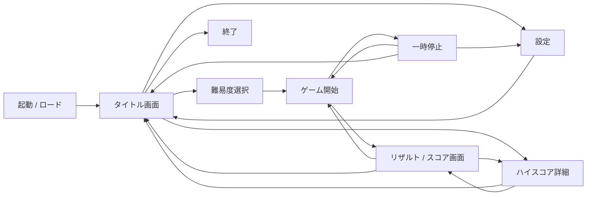
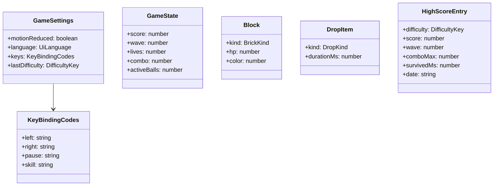
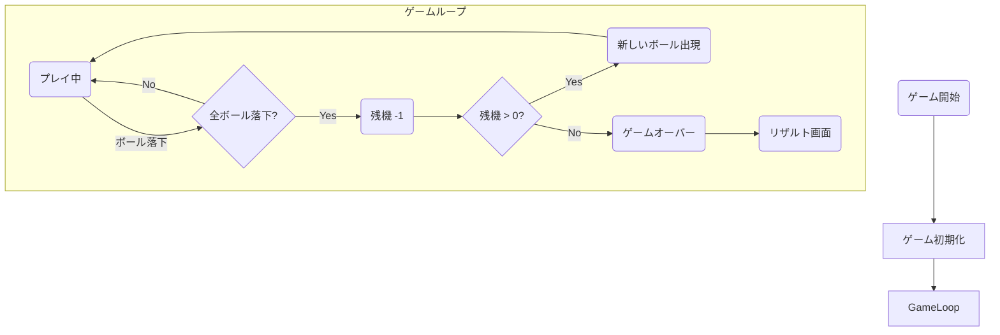

# ブロック崩し（ローグライク型）ゲーム 詳細設計書

## エグゼクティブサマリ

本設計書は、透過画像をベースにしたシルエットを崩すローグライク型ブロック崩しゲームの詳細設計を示す。機能要件としては、左右移動によるパドル操作、ボールの跳ね返り演算、破壊対象ブロック（通常・耐久・特殊）の管理、難易度選択、アイテム取得と効果、スコアとハイスコア保存などがある。非機能要件として性能（多数セルでも60FPS維持）、メンテナビリティ（責務分割・モジュール化）、再現性（Node.jsバージョン固定、lockファイル管理）等を満たす。技術スタックは、TypeScript＋Phaser＋Vite＋pnpm＋Tauriを採用する。Phaserは2Dブロック崩しに適したゲームエンジンであり、画像レンダリングや衝突検出、アニメーションなど基本機能を支援する【14†L207-L211】。Viteは開発サーバー起動やホットリロードを極めて高速に行い【22†L27-L30】、pnpmは依存管理の高速性とディスク節約性で開発効率を向上する【20†L92-L99】。TauriはWindows用インストーラー（.exe/.msi）を生成可能で、ユーザーにNode環境を要求しない軽量なデスクトップ化手法である【16†L215-L221】。これにより、要件で示されたWindows向け配布形式やシステム構成をすべて満たす。

設計ではまず、機能一覧および画面構成を定義し、各画面のUI要素・バリデーション・エラーメッセージ・アクセシビリティ方針を詳細化する。API呼び出しは外部連携を想定しない（完全オフライン）ため省略し、内部データはゲーム状態や設定、ハイスコア等のオブジェクトで扱う。ビジネスロジックはフローチャートで示し、非機能要件では性能・可用性・セキュリティ・ログ・監視方針を列挙する。テスト計画には単体・結合・受入テストケース例を示し、運用手順ではビルド/リリース（デプロイ）、ロールバック、バックアップ方針を記載する。認証方式や外部API、CI/CD要件など未指定部分は設計仮定として明示し、要件に基づく前提条件を列挙する。本書をもとに、開発チームが実装可能なレベルで具体化された設計を提供する。

## 機能一覧（優先度・依存関係）

機能の優先度と依存関係は開発順序と実装容易性を踏まえて決定する。主要機能はゲームプレイに直結する要素とし、以下のように一覧化した。  

- **ゲームプレイコア**（高）: パドル操作、ボール挙動（跳ね返り計算）、ブロック崩壊判定、ウェーブ進行。依存: なし（最優先実装）。  
- **難易度設定**（高）: 5段階（Easy～Extreme）の初期難易度選択。依存: タイトル画面起点、ゲームコアで各パラメータ反映。  
- **アイテム・特殊機能**（中）: パドル拡大/縮小、マルチボール、ボール速度変化等のドロップアイテム。依存: ゲームプレイコア（衝突時発生）。  
- **ブロック種類拡張**（中）: 耐久ブロック（複数ヒット）、移動ブロック（水平往復、Wave 3以降）、アイテムブロック（破壊時ドロップ生成）、消滅ブロック（視覚区別のみ、特殊挙動なし）。依存: ゲームプレイコア。  
- **スコア管理**（中）: スコア計算、連鎖（コンボ）機能、ゲームオーバー時のスコア算出。依存: ゲームプレイコア。  
- **ハイスコア保存**（中）: ゲーム終了時の成績保存と表示。依存: スコア管理、ローカルストレージ（ファイル）実装。  
- **画面遷移/UI**（高）: 起動/ロード→タイトル→（難易度選択, 設定, ハイスコア）→ゲーム→ポーズ→リザルト/スコア→ハイスコア詳細。依存: 各機能から起動・終了への遷移に必要。  
- **オーディオ**（低）: BGM/効果音の再生とボリューム制御。依存: 設定画面（ボリューム変更機能）、ゲーム中音声再生。  
- **アクセシビリティ設定**（低）: 画面の明るさ（テーマ切替）、テキスト倍率など。依存: 設定画面で変更可能にし、ゲーム画面へ反映。  
- **設定保持・再現性**（中）: ゲーム設定（ボリューム、キー設定等）の永続化。依存: ストレージ機能。  
- **エラーハンドリング**（中）: アセット読み込み失敗や予期せぬ例外時のメッセージ表示。依存: 全画面共通機能。

なお、未指定の要件（認証方式、外部連携API、CI/CD環境など）は本設計では考慮せず、「未解決事項」としてリスト化する。必要な機能・画面は以上を含み、実装フェーズにて具体化する。

## 画面一覧と遷移

ゲームは以下の主要画面で構成する。**画面構成**および**画面遷移図**を下記に示す。起動時の初期画面から、タイトル、難易度選択、設定、一時停止、リザルト、ハイスコア参照など、ユーザーの操作フローを包括する設計とした。

- **起動／ロード画面**: アプリケーション起動直後に表示。ロゴやロード進捗を表示し、必須アセットや保存データを初期化。  
- **タイトル画面**: 世界観提示およびゲーム開始導線。ロゴ表示と共に「ゲーム開始」「難易度選択」「設定」「ハイスコア閲覧」「終了」などのボタンを配置。  
- **難易度選択画面**: 5種の難易度（Easy/Normal/Hard/Very Hard/Extreme）カード表示と簡易説明。選択・決定ボタンと「戻る」ボタンを設置。  
- **設定画面**: BGM/SE音量、画面明度（テーマ切替）、アニメーションオンオフ、テキスト倍率、言語、キー設定などの変更機能（提案）。任意の値入力および保存・戻る操作を提供。  
- **ゲーム画面**: 実際のプレイ領域。パドル、ボール、ブロックが配置されたキャンバス、HUD（スコア、残機、ウェーブ番号、コンボ数、スキルゲージ、アイテム効果表示など）を表示。ESCキーでポーズ。  
- **一時停止画面**: プレイ中断用のオーバーレイ。継続（再開）、設定変更、タイトルへ戻る選択肢と、現在ウェーブ数など状況表示を行う。  
- **リザルト／スコア画面**: ゲームオーバー時に成績提示。最終スコア、到達ウェーブ、最大コンボ、経過時間、ノーミス達成表示、新記録更新有無などを表示。再挑戦（Play Again）、タイトル戻り、ハイスコア参照への遷移ボタンを配置。  
- **ハイスコア詳細画面**: ローカルに保存した上位スコア一覧表示（難易度バッジ、スコア、到達ウェーブ、日時）。戻る操作を提供。  

この遷移により、「初期難易度の選択」「無限モード」「ローカルハイスコア保存」といった要件を過不足なく網羅する。また、設定画面はタイトルとポーズの両方からアクセス可能とし、ユーザーがいつでも環境設定できる合理的な構成とした。

## 各画面のUI詳細

### 起動/ロード画面

**要素**: アプリ起動時に表示するロゴやブランド名、ローディングインジケータ、読み込み中メッセージ。  
**動作・バリデーション**: バックグラウンドでアセットや保存データをロード。正常終了後、自動でタイトル画面へ遷移。  
**エラーメッセージ**: 例）「読み込みに失敗しました。アプリを再起動してください。」など。エラー検出時は画面上に表示し、ユーザーに再起動などの案内を行う。  
**アクセシビリティ**: ロゴ画像には代替テキストを設定し、スクリーンリーダー対応。テキスト・プログレスバーはコントラストを十分に取り、大きなフォントサイズで表示することで視認性を確保する（WCAG 2.2に準拠）【4†L53-L59】。  

### タイトル画面

**要素**:  
- 大きなロゴやタイトル名。  
- 「ゲーム開始」ボタン（遷移先：難易度選択または直接ゲーム開始）、  
- 「難易度」サマリ表示（現在選択中の初期難易度）、  
- 「設定」「ハイスコア」「終了」ボタン。  
- 既存ハイスコアのサマリ（例：最高スコアと到達ウェーブ表示）。  

**バリデーション・エラー**: 特になし（ユーザー入力はボタン操作のみ）。万一データ読み込みに失敗した場合はアラート表示。  
**アクセシビリティ**: ボタンやテキストは高コントラスト配色で大きめに表示。フォーカス可能なUIでキーボード操作対応。各ボタンには明確なラベルを付与し、音声読み上げも考慮。設定でフォント倍率を上げられるようにする【4†L53-L59】。

### 難易度選択画面

**要素**:  
- 5つの難易度カード（Easy/Normal/Hard/Very Hard/Extreme）と、各カードに「ボール速度」「パドル幅」などの難易度差分説明。  
- 選択中のハイライト表示。  
- 「決定」ボタン（ゲーム開始遷移）と「戻る」ボタン（タイトル画面へ）。  

**バリデーション**: 「決定」ボタン押下時、難易度が未選択の場合は警告表示（カード枠を赤く点滅するなど）。  
**エラーメッセージ**: 「難易度を選択してください。」など、画面上部に簡易表示。  
**アクセシビリティ**: カードはテキスト中心で色ではなく枠やアイコンで区別。テキスト倍率やコントラスト設定が反映されるようにする。キーボード左右キーでもカード選択可能とし、音声読み上げに対応させる。

### 設定画面

**要素**:  
- **モーション低減**: チェックボックス（トグル）。有効時、長いアニメーション・画面揺れを縮退または停止する。  
- **言語選択**: 日本語（ja）/ English（en）のセレクト。変更は即時反映。  
- **キー配置変更**: 左移動・右移動・一時停止・スキルの4キーを個別にキャプチャ式で変更可能。  
- **ログエクスポート**: インメモリイベントログを `.txt` ファイルとしてダウンロードするボタン。  
- **音量設定**: 未実装（将来対応予定）。  
- 「保存」ボタン、「戻る」ボタン。  

**バリデーション・エラー**: キー設定は重複や衝突があればエラーメッセージを表示（同一キー割り当て不可）。重複がある場合は保存ボタンを無効化する。  
**アクセシビリティ**: ラベルは画面読み上げ対応。コントロール間に十分なスペースを設け、大きなフォント・ボタンを配置。WCAGに倣い、UI要素間のフォーカス順序やランドマークを明確に設定する。

### ゲーム画面

**要素**:  
- **プレイ領域**: HTML Canvas上にパドル、ボール、ブロックがレンダリングされる。  
- **HUD**（画面外または上部・下部オーバーレイで表示）:  
  - スコア（得点）表示、  
  - 残機（アイコンで球数を表示）、  
  - 到達ウェーブ番号、  
  - 最大コンボ数、  
  - スキルゲージ（溜まると特殊効果発動可能なゲージ）、  
  - 効果中アイテム表示（例：”PADEL+”アイコンなど）。  
- **操作**: パドルの左右移動はキーボード（←→またはA/D）。ESCキーでポーズ画面へ遷移。  
- **その他**: ゲーム中はBGM/SEが流れる。  

**バリデーション・エラー**: 通常ユーザー入力はキー操作のみ。ゲームエンジン内部エラー（資産ロード失敗など）が発生した場合は、画面上部に例外メッセージを表示しメインメニューへ遷移。  
**アクセシビリティ**: ゲームプレイはテンポ重視の仕様だが、UI要素（スコア等）には十分なフォントサイズを確保。背景（ブロックと効果）のコントラストも調整し、重要情報が埋もれないようにする。また、ボールの色・エフェクトにも注意し、色覚に配慮した配色にする。設定でテキスト倍率やコントラストモードを反映することで、視認性を高める【4†L53-L59】。

### 一時停止画面

**要素**:  
- 「一時停止中」とのテキスト。  
- 「再開」「設定」「タイトルへ戻る」ボタン。  
- プレイ中の統計（現在スコア、ウェーブ数、残機など）を表示。  

**バリデーション・エラー**: 特になし。ボタン選択で操作するだけ。タイトルへ戻る際は確認ダイアログ（「ランのスコアは記録されません。終了してもよろしいですか？」）を表示して誤操作防止。途中離脱時はスコアを保存しない仕様とする。  
**アクセシビリティ**: 文字が読みやすいようダークオーバーレイで背景を暗くし、文字色を白にするなど明度コントラストを確保。キーボードでもメニュー項目にフォーカスできる。  

### リザルト／スコア画面

**要素**:  
- 最終スコア（合計）、到達ウェーブ、最大コンボ数、生存時間、ノーミス達成（あればバッジ）など成績表示。スコア内訳の分解表示は現時点では省略。  
- 新記録更新時は「NEW RECORD！」バッジを強調。  
- 「再挑戦」「タイトルへ戻る」「ハイスコア詳細」ボタン。  

**バリデーション・エラー**: なし（ユーザー選択のみ）。  
**アクセシビリティ**: 成績数字は大きめフォント、主要情報は強調表示。画面読み上げ向けにスコアや説明文はテキストとして記述。高コントラストで表示する。

### ハイスコア詳細画面

**要素**:  
- 全難易度一括のランキング表（順位、スコア、到達ウェーブ、難易度バッジ、日時）。上限20件をスコア降順で表示。  
- 「閉じる」ボタン。  

**バリデーション・エラー**: スコアデータが空の場合は「記録なし」のメッセージを表示。  
**アクセシビリティ**: 表は読みやすく列ヘッダを明示。コントラストに配慮。  

## API仕様

本アプリは完全オフライン動作を想定しており、外部サーバーとの通信や認証/認可機能は**未指定**である。したがって、REST APIエンドポイントは存在せず、サーバーとの連携は行わない設計とする。将来的にオンライン機能（ランキング共有など）を追加する場合、その際に別途API仕様を定義する。現在は内部的にTauriのストレージ機能やファイル（JSON）で設定・スコアを管理し、**認証/認可なし**で動作する。

## データモデル（オブジェクト/DTO 定義）

DBは使用しないが、アプリ内部で扱うデータ構造（オブジェクト/DTO）を以下に示す。クラス相関図にはMermaidの`classDiagram`を使用し、主要オブジェクトを定義する。

- **GameSettings**: モーション低減フラグ、表示言語（ja/en）、キーバインド、直前の難易度を保持。localStorage キー `breaking-blocks-settings-v1` で永続化。  
- **KeyBindingCodes**: 左右移動・ポーズ・スキルの `KeyboardEvent.code` を保持。  
- **GameState**: プレイ中のスコア、現在ウェーブ、残機、コンボ数、現行アクティブボール数などゲーム進行状況。  
- **Block**: 各ブロックの種類（normal/durable/moving/item/vanishing）、HP、表示色を保持。  
- **DropItem**: ドロップアイテムの種類（paddleWide/paddleNarrow/multiBall/multiBall3/multiBall5/multiBallDouble/ballFast/ballSlow/timeExtend）と効果時間。  
- **HighScoreEntry**: ローカルハイスコアレコード（難易度、スコア、到達ウェーブ、最大コンボ、生存時間、日時）。localStorage キー `breaking-blocks-highscores-v1` で永続化（上限20件）。  

これらオブジェクトは必要に応じて配列やマップで管理する。`HighScoreEntry` は全難易度を一括で1リストにスコア降順ソートして保存する。

## ビジネスロジック／フロー

ゲームの主要フローをMermaidのフローチャートで示す。主にゲーム開始からオーバーまでのループを表現する。

**説明**: ゲーム開始時に状態を初期化し（ライフ、スコア、ウェーブ、ブロック配置等）、プレイ中はボールが落下する度に残機を-1する。残機が0になるとゲーム終了となり、リザルト画面へ遷移する。各ウェーブで全ブロックを破壊すると次ウェーブに進み（上図には省略）、難易度に応じたパラメータ変化（ウェーブ進行時のブロック・球速調整）を行う。ビジネスロジックは各種条件分岐と状態遷移から構成される。

## 非機能要件

- **性能**: フレームレート60FPS維持を目標とする。ブロック数が増大してもフレーム落ちしないよう、**描画・衝突判定アルゴリズムの最適化**を行う。例えば、Canvas描画の矩形クリッピングや衝突範囲限定処理を実装し、負荷分散を図る。  
- **可用性**: クライアント単体アプリのため常時稼働要件は低いが、**安定動作**を重視する。クラッシュ防止のため例外は捕捉して画面に通知し、自動的にタイトル画面へ復帰する機構を設ける。長時間プレイでもメモリリークや入力遅延が発生しないこと。  
- **セキュリティ**: オフライン環境のクライアントアプリとしても、WebView内でのXSS対策やファイル読取権限管理を行う（Tauriのセキュリティモデルを活用）。ユーザー提供情報は特にないため認証は不要だが、悪意あるコード実行防止のため、コンテンツセキュリティポリシー（CSP）を設定する。  
- **ログ**: エラー検出時はローカルログファイル（例：アプリデータフォルダ内のログ）に詳細を出力する。Tauriのログ機能を利用し、例外発生時刻・スタックトレースを記録。**運用監視**では、アプリの利用状況ログ（プレイ回数、終了原因など）の収集も考慮し、将来の品質改善につなげる。  
- **監視**: 基本的にスタンドアロンのため外部監視は不要だが、製品品質向上のためオプションでエラーレポート送信（クラッシュレポート）機能を実装することを検討してもよい。  

- **アクセシビリティ（非機能）**: WCAG 2.2に準拠し、視覚障害者等への対応を行う【4†L53-L59】。例えば、フォント拡大対応、十分なコントラスト、色盲モード等。各画面のコンテンツは論理的な読み上げ順を持ち、全ての操作はキーボードのみでも可能とする。

## テスト計画

以下にテストケース例を示す。具体的なシナリオを想定して、単体・結合・受入テストを計画する。

- **単体テスト例**:  
  - *Ballクラスの反射角計算*: パドルの位置とボールの着弾位置に応じて角度が変化することをテスト。  
  - *Block耐久減算*: 耐久ブロックにボールヒット時、耐久値が1減り、0で破壊フラグが立つことを確認。  
  - *アイテム効果処理*: 拡大アイテム取得後、パドル幅が所定量増加することを検証。  

- **結合テスト例**:  
  - *画面遷移検証*: タイトル画面から難易度を選択し、「決定」でゲーム画面が開始されること。ESCキーでポーズ画面に入り、「再開」で元のゲーム画面に戻る動作。  
  - *設定反映*: 設定画面でBGM音量を0にした後、ゲーム画面でBGMがミュートされていることを確認。キー割当を変更し、そのキーでパドルが動くことを確認。  
  - *ハイスコア保存*: ゲームオーバー時に得たスコアが所定の難易度でローカル保存され、ハイスコア一覧画面に反映されること。  

- **受入テスト例**:  
  - *難易度別プレイ*: 各初期難易度（Easy～Extreme）で複数プレイし、初期球速やパドル幅が異なること（要件通り）を確認。  
  - *長時間安定性*: 継続プレイ（ウェーブを超えて数十分）しても異常クラッシュせず正しく動作し続けること。  
  - *UI動作*: すべての画面でボタン・リンクが想定通り動作するか、フォーム入力（音量スライダー、キー設定など）の境界値（0%,100%）で期待通りに動作するかを検証【25†L77-L81】。  

**注**: テストケース設計では、UIテストの要素（ボタン/リンクの動作、レイアウトの整合性、フォーム入力検証、遷移確認など）を含める【25†L77-L81】。動作結果のログ取得やキャプチャ記録も行い、不具合発生時の原因特定を容易にする。

## 運用手順

- **デプロイ (ビルド/リリース)**: GitHub Actions等CI環境で `pnpm install && pnpm tauri build` を実行し、Windows用インストーラー（setup.exe/.msi）を生成する。生成したインストーラーは社内共有フォルダや配布サイトへアップロードし、ユーザーが取得できるようにする。リリース毎にバージョン番号（例：`v1.0.0`）を付与し、CHANGELOGに更新内容を記録する。  
- **ロールバック**: 新バージョンに深刻な問題があった場合は、前バージョンのインストーラーを再配布する。アプリには独自のロールバック機能は不要とし、ユーザーには既存インストーラーの再実行を案内する。バージョン管理と公開手順を文書化しておくこと。  
- **バックアップ方針**: DB不使用のため、ユーザー設定やハイスコアはローカルファイルに保存する（例：ユーザーフォルダ内のJSONファイル）。重要データ（設定、スコア）は定期的にバックアップを案内する。必要に応じて「データエクスポート」機能を実装し、ユーザーがファイルコピーでバックアップ可能にする。Tauriのストレージプラグインやファイルシステムアクセスを用い、ファイル形式（JSON/XML）を定めておく。  

- **監視・ログ**: ログファイル（エラーログ）やユーザー操作ログはアプリディレクトリ内に出力し、問題発生時に開発チームが参照できるようにする。ユーザー側でログを提出しやすいよう、設定画面に「ログエクスポート」機能を設けるのも検討する。  

## 移行/互換性注意点

- **OS互換性**: Windows 10 以降を対象とする。WebView2が必須なため、事前インストールまたはアプリ起動時にインストール手順を案内する。32bit/64bit対応はTauri設定で両方ビルド可能。  
- **旧データ互換**: 将来アプリ版アップデート時にデータ形式を変更する場合は、古い設定ファイル/スコアファイルのマイグレーション機能を実装する。例：キー設定項目追加や設定構造変化に伴う変換処理。  
- **サードパーティライブラリ**: PhaserやVite、Tauriなどの主要ライブラリのメジャーアップデートでは互換性破壊がないか注意し、移行ガイドに従い段階的に対応する。特にTauriの安定版変更（v2→v3等）には設定ファイル変更が必要となる場合がある。  
- **言語追加**: 多言語対応を将来検討する場合、文字列リソース管理（i18n）の仕組みを予め導入しておくと良い。  

## 未解決事項と前提条件

- **認証/認可**: オンライン機能やユーザーアカウント機能は要件に含まれておらず、本設計では未指定とする。すべての操作はローカルユーザとして行い、認証は不要とする。  
- **外部API仕様**: オンラインランキングや外部サービス連携は要件外とし、未検討項目とする。必要に応じて将来バージョンで検討する。  
- **CI/CD要件**: CI/CD基盤（OS、クラウド環境など）は明記されていないため未指定とする。一般的なNode.js/Tauri開発環境（例：GitHub ActionsでWindowsビルド）を想定し、必要があればパイプライン構築手順を別途記載する。  
- **入力デバイス**: キーボード操作（左右移動、ESC）が指定されている。ゲームパッドやタッチ対応は要件外。追加する場合は別途設計。  
- **ウィンドウサイズ/フルスクリーン**: 既定では固定解像度でウィンドウ起動（アスペクト比固定）。全画面対応や可変解像度対応は未指定であり、実装時に必要性を検討する。  

上記未解決事項は設計上「未指定」とし、プロジェクト初期にステークホルダーと確認のうえ決定する。前提条件としては「Windows環境での単独起動」「ネットワーク接続不要」「Node.js等ユーザー環境依存なし」などがある。

**参考:** MDN Web DocsではPhaserを用いたブロック崩し例が示されており【14†L207-L211】、本設計のフレームワーク選定・ゲームメカニズムに沿った開発が可能であることが裏付けられている。また、pnpmの高速・省容量性【20†L92-L99】やViteの高速開発サーバー【22†L27-L30】などは採用技術の正当性を支える情報源である。

